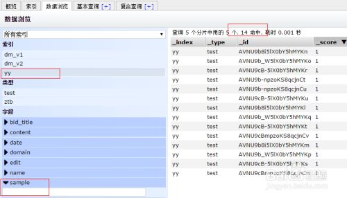
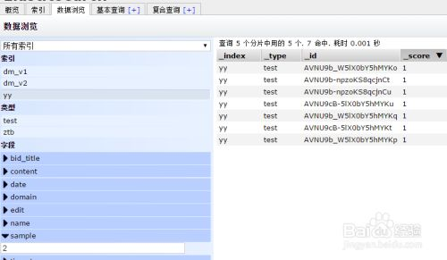
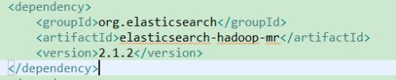
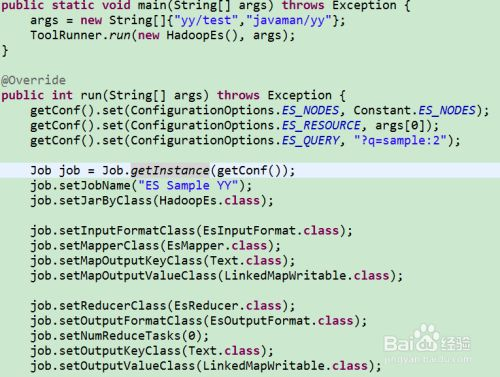
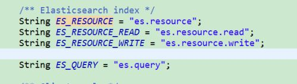
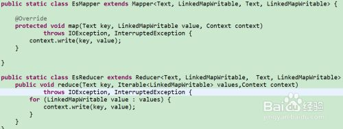
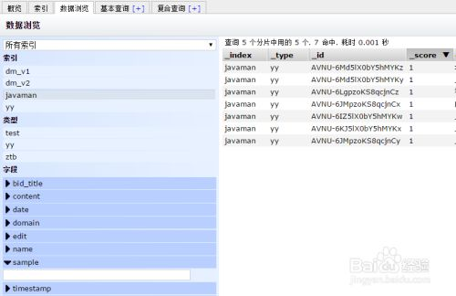
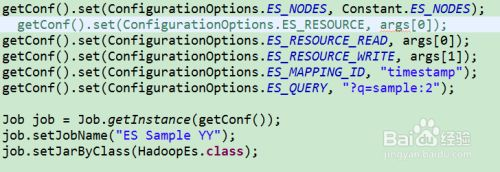
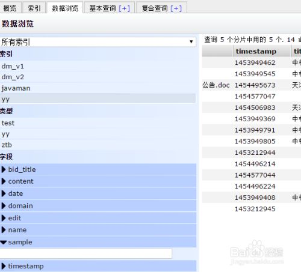
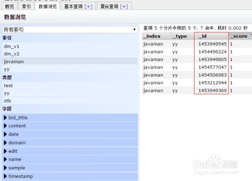

# Hadoop 读写 Elasticsearch

使用Hadoop操作Elasticsearch的方法，关键是指定

InputFormatClass ： EsInputFormat.class

OutputFormatClass： EsOutputFormat.class，这个好像是ES官方提供的集成包。

网上查了相关资料貌似挺少的。

直接用一个例子来看如何使用了，Java实现。

例子：通过Map/Reduce将yy/test中sample值为2的数据移到javaman/yy中

## 方法/步骤

1. 

   在Elasticsearch中建一些测试数据吧

   yy/test中总共14条数据，sample=2的有7条数据

   

   

2. 

   导入jar包

   <dependency>

     <groupId>org.elasticsearch</groupId>

     <artifactId>elasticsearch-hadoop-mr</artifactId>

     <version>2.1.2</version>

   </dependency>

   

3. 

   设置ES节点信息：

   getConf().set(ConfigurationOptions.ES_NODES, Constant.ES_NODES);

   指定index和type：

   getConf().set(ConfigurationOptions.ES_RESOURCE, args[0]);

   如果对一个index操作这里直接这样写就可以了，如果读写不同index就需要分别指定了：

   getConf().set("es.resource.read", args[0]);

   getConf().set("es.resource.write", args[1]);

   查询条件：

   getConf().set(ConfigurationOptions.ES_QUERY, "?q=sample:2");

   

   

4. 

   写Map/Reduece

   

   EsOutputFormat没有使用这里的key作为id，所以这里的key是没有用的，随便写啥都行。。。

   

5. 

   直接运行查看下结果

   成功将7条记录复制到了javaman中了。

   这时候id是ES自动生成的，如何我们自己指定id呢？

   

6. 

   使用指定属性的值来作为id，我这里测试就用timestamp吧。使用中用你的值唯一的可以作为主键的属性都可以的。

   getConf().set("ConfigurationOptions.ES_MAPPING_ID", "timestamp");

   也可以在reduce中在MapWritable中添加唯一属性也是可以的。

   

7. 

   删除javaman的index，重新运行看下结果吧

   新的index中的id和timestamp值一致。

   

   OK，这里主要时对ES的读写，后面把操作MongoDB、Mysql。。也简单整理下，也方便时间久了之后查看。

   

   

   END